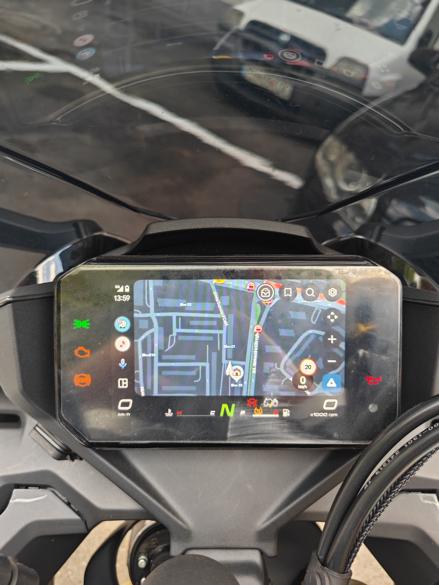

# OpenCfMoto - 450SR — forked from [BojanJ](https://github.com/BojanJ/open-cfmoto/)

## download from [releases](https://github.com/ionutradu252/open-cfmoto/releases)

Android Auto on the 2025 CFMOTO 450SR dash — model id `66660742`, CFDL16 display (landscape),
sdkVersion `0.9.23.4`. Tested on a Xiaomi 13 / Android 16.

## what works
- **Android Auto on the bike's screen** — Maps, Waze, Spotify, whatever you already use
- **fills the whole dash**, smooth, nothing cropped, no flickering
- **set up once** — scan the QR the dash shows, and that's the last time you'll see the scanner.
  After that: ignition on, open the app, it connects on its own
- **survives an ignition cycle** — stop for fuel, switch the bike off and on, it re-joins by itself
- **the handlebar buttons control it** — ▲▼ scroll through menus, enter selects, ▼▼ = back,
  ▲▲ = home. Every one of them can be remapped, including to "navigate to a saved address"
- **voice works** — ask the Assistant for directions through your helmet mic, without stopping
- **type a destination in the app** and the route appears on the dash
- **sound works as usual** — music and nav voice reach your helmet the way they always did

## what doesn't
- **your music pauses while the handlebar buttons are set to drive Android Auto.** Android only lets
  one app own those buttons at a time. Switch it off in Settings when you want music control back
- **holding ▲/▼** (next/previous track) does nothing while Android Auto is on the screen
- **double-pressing enter** does nothing — the dash can't send it quickly enough to tell it apart
  from two normal presses. Use a volume double tap instead
- only tested on a 450SR with a Xiaomi 13 — other bikes/phones are a coin flip

## in app screenshots
 

## fixes + new features

**connection**
- fixes for wifi-direct, added profile for 2025 CFMOTO 450SR — the dash hands out a
  `DIRECT-go-CFMOTO-…` SSID with no default route, so the bike is now found at `.1` of the phone's own
  /24 (it just aborted before this)
- phone emits a handshake/heartbeat so the headunit doesn't disconnect and reconnect after ~7 seconds
  (this dash never sends its own heartbeat, so the control socket sat idle and its watchdog killed the
  session)
- **QR is remembered** — auto-connects when you open the app, no scanning. Re-joins by itself if you
  switch the bike off and back on, and gives up after ~2 min with no bike so it doesn't drain battery

**picture**
- **green flashing fixed** — the encoder outran the dash's ~24 fps pull, and each dropped frame broke
  the H.264 chain until the next keyframe. Now paced to the dash, and a forced keyframe on overrun
- **fills the whole screen with nothing cropped** — Android Auto can't render 800x400, so it's told to
  keep its UI inside the visible band (margins) and the leftover band is cropped away
- fill ↔ letterbox toggle, applies live

**control** (this dash is not a touchscreen)
- **handlebar buttons drive Android Auto.** The buttons never appear on the PXC link — they reach the
  phone as Bluetooth AVRCP. Defaults: press ▲/▼ = knob (step through lists), enter = select,
  double-tap ▼▼ = back, double-tap ▲▲ = home. Toggle in Settings; off = normal music/volume
- **every gesture is remappable** (Settings → Customize buttons), with a reset to defaults. All five
  usable gestures × every action Android Auto accepts — knob, D-pad, select, back, home, Assistant,
  do-nothing — plus **navigate to a saved place**: put an address in a slot, map it to a button, and
  that button starts turn-by-turn there with the phone in your pocket (needs "Display over other
  apps", since Android blocks background apps from opening Maps). Want voice from the bars? Map a
  double tap to Assistant
- a double tap is read from the *size* of the volume jump (±3 steps or more from the pin), not from
  two events arriving close together: the dash coalesces both presses into ONE absolute-volume
  message, so the timing-based version could never fire
- media focus is re-asserted once the bike link is up, so the dash re-reads the player it first saw
  ~8 s too early (this is what manually toggling the switch off and on was working around)
- on-screen D-pad + rotary knob in the app
- **"Navigate to…"** — type an address, turn-by-turn shows up on the dash, no on-dash interaction
- Android Auto is declared as a rotary head unit, otherwise it renders no focus highlight to move

**voice**
- **microphone works** — the phone is presented to Android Auto as the head unit's mic, so the
  Assistant can hear you. Capture prefers the Bluetooth headset (Cardo → bike → phone) over the
  phone's own mic. There's a button in the app, and any handlebar gesture can be mapped to it

**app**
- four-tab Material 3 UI — Connect (pair → connect → navigate), Control (knob / D-pad / voice),
  Settings, Logs — with a live status header (AA / fps / bike / frames) and an in-app tutorial
- log mirroring and the status refresh stop when the app isn't on screen, so a pocketed phone with
  the screen off isn't paying for UI it isn't showing
- logs for HID (buttons) input — kept for future dashes; the 450SR sends nothing over PXC

## current bugs
- **Android Auto audio not routed through the bike** — AA's own audio is discarded on our side. In
  practice sound still works, because AA plays through the phone → bluetooth → bike → helmet. The
  switch for routing it properly is in Settings, disabled until it's built
- **while the bike-button toggle is on your music player pauses** — Android gives the media buttons
  to exactly one app, so taking them takes them from your player. Toggle it off for normal music
- **holding ▲/▼ does nothing while projecting.** The hold arrives fine (the dash sends it as
  next/previous track, even mid-projection) but Android Auto ignores whatever we forward from it, so
  the gesture is gone from the mapping list. Short-press ▲/▼ does the same job anyway
- **no double-press of enter.** The dash won't emit two play/pause events close enough together to
  tell a double from two singles, so that gesture doesn't exist. Use a volume double tap for the
  Assistant
- occasional brief video stutter under heavy input (no disconnect)

## versions
- **v0.1.2-cfdl16** — bike buttons (volume→knob, enter→select, double-tap→back/home) now fully
  remappable + navigate-to-a-saved-place, microphone + Assistant, no-crop fill via margins, green
  flashing fixed, auto-connect + auto-reconnect, four-tab Material 3 UI with tutorial,
  "Navigate to…" box, status header
- **v0.1.1-cfdl16** — wifi-direct + 450SR profile, heartbeat fix, HID input logging

---
*thanks a lot to [BojanJ](https://github.com/BojanJ/open-cfmoto/) for the work*
---

*OpenCfMoto builds on the excellent [headunit-revived](https://github.com/andreknieriem/headunit-revived)
project. See the `docs/` folder for the technical/architecture write-ups.*
